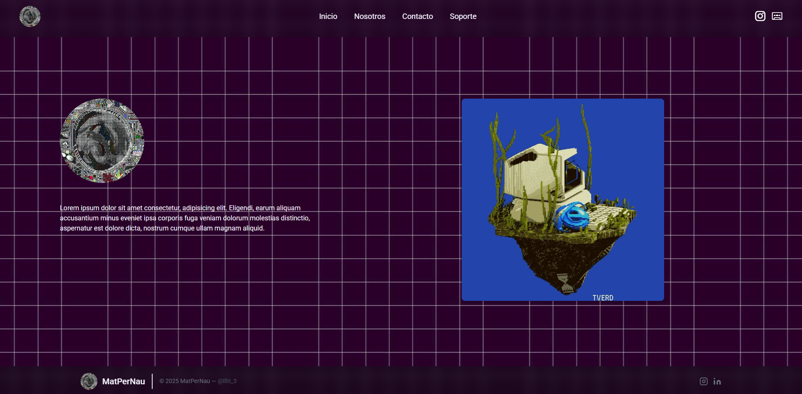
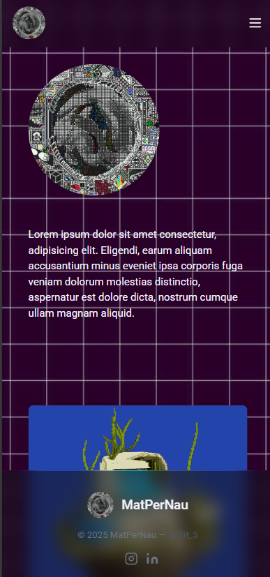

    <h2>Demo Escritorio</h2>
    
    <h2>Demo Mobile</h2>
    

### 💡 Interfaz intuitiva y optimizada
Construida con React y TailwindCSS, nuestra aplicación ofrece una experiencia rápida y adaptativa, asegurando interactividad y rendimiento sin compromisos.
### ⚡ Desarrollo ágil y escalable
Gracias a una arquitectura modular, integración con Prisma ORM y conexiones fluidas con API REST y GraphQL, optimizamos cada proceso para garantizar eficiencia y escalabilidad.
### 🛠 Perfecta para pruebas, pero lista para producción
Aunque nació como una app demo, hemos refinado cada aspecto para ofrecer una versión totalmente funcional que ya está operativa en entornos reales.
### 🔗 Conectividad sin fricciones
Sincronización de datos en tiempo real, administración de bases de datos eficiente y compatibilidad total con herramientas de exportación como CSV, Excel y PDF.
### 🌍 Impulsa tu desarrollo ahora
No más pruebas, no más incertidumbre: esta aplicación ya está lista para integrarse a tu flujo de trabajo y mejorar la eficiencia de tu equipo

-------------

#### LINKS

- https://tailwindcss.com/plus/ui-blocks/marketing/elements/headers
- https://www.flaticon.es/icono-gratis/codificacion_1170072?term=code&page=1&position=10&origin=search&related_id=1170072
- https://fonts.google.com/selection/embed
- https://icons.getbootstrap.com/
- https://tailblocks.cc/
- https://uicolors.app/generate/120d17
